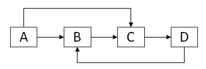
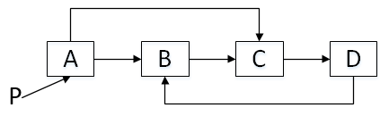
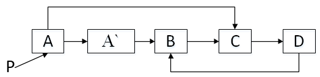
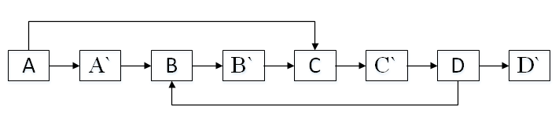
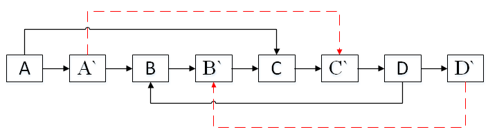
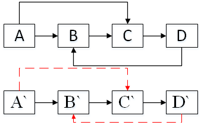

## 题目描述

A linked list is given such that each node contains an additional random pointer which could point to any node in the list or null.Return a deep copy of the list.

## 题目解析
其实这个题目跟剑指offer里面题目35复制复杂链表是一样的。我们以下图为例


所以这个题也是分为三步：
- 第一步：逐一复制A和B和C和D，复制后为A'、B'、C'和D'（加'是为了表示方便，实际上还是原来的值’），并把他们分别插入到原节点后面。
  代码如下：
```
        for(p=head;p;p=p->next){
            copy = new RandomListNode(p->label);
            copy->next = p->next; // insert new at old next
            p = p->next = copy;
        }
```
for循环中的p=head就实现了这样的功能：


for循环里面第一个语句就是新建一个节点（例如A'），第二行就是把这个A'的next指针指向B（因为原本A的next就是B的地址），然后把A'的地址赋值给p->next，也就是说head->的next是A'（即第三行里面的p->next=copy）。


然后的把p->next的地址给p，也就是把copy的地址（A'）给p，这个时候p又指向了A'。
然后判断p是否是空呢？不是，那么就把p移动到下一个节点，也就是B了。然后再同理进行操作，直到最后一个节点复制完成，退出循环。这个时候结果如下：


- 第二步：复制random结点。这一部分其实就是很简单，遍历A/B/C/D，然后判断这个节点（假设为X）的random指针有没有指向某个地方（也就是!nullptr），如果有的话就复制到相应的节点（A'）的random上。
  这部分也是很巧妙的利用了for循环的第三个参数和函数体里面的第一个语句实现了copy指向X'，p指向X（这里，假如此时p指向X,那么运行copy=p->next之后，copy指向了X，然后执行p=copy->next之后，p指向了（X+1），以此类推）。

```c++
        for(p=head;p;p=copy->next){
            copy = p->next;          // copy random point
            copy->random = (p->random?p->random->next:NULL);
        }
```
此时的结果为


- 第三步：断链。实现A->B->C->D，和A'->B'->C'->D'。先让p指向head，head是原本的ABCD那条链。因为我们要返回head，所以我们可以把head指向copy，然后操作copy即可。在for后面的第一个条件语句执行之后，p指向了A，copy和head指向了A'。然后下面自然就是进行断链操作了。断链结果如图所示。head指向的是copy，所以return head返回的就是图中下面的链。




## 代码实现

```c++
/**
 * Definition for singly-linked list with a random pointer.
 * struct RandomListNode {
 *     int label;
 *     RandomListNode *next, *random;
 *     RandomListNode(int x) : label(x), next(NULL), random(NULL) {}
 * };
 */
class Solution {
public:
    RandomListNode *copyRandomList(RandomListNode *head) {
        RandomListNode *copy,*p;
        if (!head) return NULL;
        for(p=head;p;p=p->next){
            copy = new RandomListNode(p->label);
            copy->next = p->next; // insert new at old next
            p = p->next = copy;
        }
        for(p=head;p;p=copy->next){
            copy = p->next;          // copy random point
            copy->random = (p->random?p->random->next:NULL);
        }
        for(p=head,head=copy=p->next;p;){
            p = p->next = copy->next; // split list
            copy = copy->next = (p?p->next:NULL);
        }
        return head;
    }
};
```