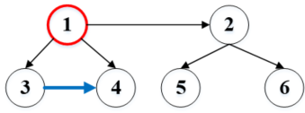
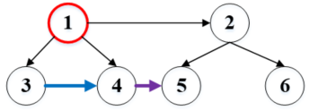

## populating next right pointers in each node

### 题目描述

题目描述

Given a binary tree

```
    struct TreeLinkNode {
      TreeLinkNode *left;
      TreeLinkNode *right;
      TreeLinkNode *next;
    }
```

Populate each next pointer to point to its next right node. If there is no next right node, the next pointer should be set toNULL.

Initially, all next pointers are set toNULL.

Note:

You may only use constant extra space.
You may assume that it is a perfect binary tree (ie, all leaves are at the same level, and every parent has two children).

For example,
Given the following perfect binary tree,

```
         1
       /  \
      2    3
     / \  / \
    4  5  6  7
```

After calling your function, the tree should look like:

```
         1 -> NULL
       /  \
      2 -> 3 -> NULL
     / \  / \
    4->5->6->7 -> NULL
```

### 原理解释

刚开始，我这个题想用递归。但是递归不满足要求（使用线性的额外空间）。所以就不用递归。.
我们可以这样考虑，用两个指针，假设为m和n。可以借鉴层序遍历的思想，我们添加next指针是完成一层厚进行下一层。那么我们就令m来指向每一层的左侧第一个元素，然后让n从左侧第一个元素一直往右进行处理。实际上，我们m和n在第i行的时候，操作的元素是第i+1行，所以当我们操作i+1行的时候，就可以用next指针实现n往右移动了。
所以思路就可以这样：
我们定义m和n，其中m指向root。然后判断当m->left不为空的时候，我们才有必要进行本程序的操作。以下的步骤都是建立在m->left不为空的时候：

- 我们令n等于m，就是相当于要从当前的m这个节点开始往右操作。当n不为空的时候，我们就直接n->left->next=n->right。建立起如下图所示，红色为当前m和n指向的结点，3就是n->left的结点，4就是n->right的这个节点：



- 接下里就是连接上图中的4和5直接的结点。首先要判断此时1右侧有没有结点，也就是n->next是否存在（若为根节点就是不存在的），存在的话那么就是n->right->next=n->next->left。这句话还是很容易明白的。即这条紫色的线。



- 在完成对1的连接之后，n就可以向右移动，对第二个结点进行相同的操作了。所以这个可以写成一个while循环。
- 当然，为了鲁棒性，开头别忘了一句话检测root是否为空，为空就返回。


下面是实现代码，其中left_point就是上面的m，flag就是上面的n。


### 代码实现

```
    void connect(TreeLinkNode *root) {
        if (!root)
            return ;
        TreeLinkNode *left_point=root,*flag;
        while(left_point->left)
        {
            flag=left_point;
            while(flag)
            {
                flag->left->next=flag->right;
                if(flag->next)
                {
                    flag->right->next=flag->next->left;
                }
                flag=flag->next;
            }
            left_point=left_point->left;
        }
        
    }
```
