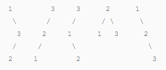

## unique binary search trees

### 题目描述


Given n, how many structurally unique BST's (binary search trees) that store values 1...n?For example,
Given n = 3, there are a total of 5 unique BST's.   



   
### 题目解析

我们可以发现，只需求出左、右子树各有多少种，二者相乘即为以 i 作为root时BST的总数。所以我们可以用动态规划来实现。当节点数为0个的时候，子树为0个，节点为1个的时候，子树为1个，节点数为2个的时候，子树为2个。当n>=3的时候，左右子树种类之积就是结果。所以我们只需要由下至上求解即可。
### 代码实现

```
    int numTrees(int n) {
        vector<int>num;
        num.push_back(1);
        for(int i=1; i<=n; i++)
        {
            num.push_back(0);
            if(i<3)
            {
                num[i]=i;
            }
            else{
                for(int j=1;j<=i;j++)
                {
                    num[i]+=num[j-1]*num[i-j];
                }
            }
                
        }
        return num[n];
    }
```
